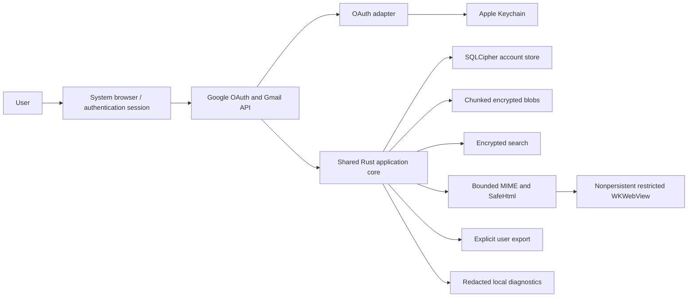

# Security data flow

## Status notation

- **Diagnostic:** implemented only in an isolated M0 spike and not available to
  a user mailbox.
- **Planned:** required by the product architecture but not implemented.
- **Implemented:** a production-shaped local boundary present in the current tree.
- **Closed:** a future boundary that must not receive data in the current tree.

## End-to-end flow

The diagram is the intended production boundary, not an implementation claim.
The authoritative gate register determines which individual edges have only
diagnostic evidence.

## Flow inventory

| Flow | Data | Boundary and controls | Current state |
|---|---|---|---|
| OAuth request and callback | Public client ID, PKCE challenge/verifier, state, authorization code | System browser/session; exact redirect and state; access token memory-only; refresh token planned for device-only Keychain | Callback transport diagnostic; real code exchange and token persistence planned |
| Gmail synchronization | Message/thread IDs, labels, headers, bodies, attachments, history cursor, pending intent | TLS and Google authorization; per-account queues; transactional cursor; bounded retry and quota policy | Planned |
| Key hierarchy | Random installation root key and account/version-derived keys | macOS Data Protection Keychain generic-password root record, fixed App Group, HKDF-SHA256 domain separation, borrowed keys, and best-effort zeroization | Implemented adapter boundary; signed cross-target interoperability remains PR 33 evidence |
| Structured storage | Account-bound message envelopes and cached bodies | Per-account SQLCipher; exact schema and integrity validation; persistent encrypted WAL; in-memory temp policy; envelope-only read capability separate from complete-body/mutation authority | macOS account store and strict reader implemented; the envelope still carries a body-derived preview that later metadata-only consumers must omit; Keychain-derived production keys, fixed App Group profile resolution, global store, drafts, pending operations, File Protection evidence, and device runtime remain planned |
| Blob storage | Attachments, inline images, thumbnails, parser results | Stream into versioned 64 KiB XChaCha20-Poly1305 chunks; authenticate account, random blob ID, index, lengths, and count; publish with a synchronized same-directory no-replace hard link; open published values without following symlinks; validate collisions through a regular, no-follow, device/inode-matched descriptor; HMAC content filename | Bounded same-filesystem host process-crash diagnostic; concurrent external writes to an already-open inode, production manifest, keys, eviction, File Protection, backup, disk-full handling, and device runtime planned |
| Search | Cached subject, addresses, body text, attachment text, query metadata | FTS5 inside SQLCipher; optional Tantivy encrypted directory without mmap; decrypted chunk cache bounded to memory | Host diagnostic; physical-device budget and production ownership planned |
| MIME and HTML | Untrusted raw message and inline resources | Pre-parse limits; typed sanitized HTML; nonpersistent WKWebView; no JavaScript, forms, downloads, navigation, remote network, or persistent website data | Rust/macOS diagnostic; iOS device and production renderer planned |
| Export, share, and clipboard | User-selected attachment or text | Explicit user action and destination preview; data is declassified after leaving the app; never an internal cache | Planned |
| Logs and evidence | Durations, counts, error classes, artifact digests | No content, addresses, query strings, credentials, paths, stable user IDs, or raw fixtures; encrypted local logs where retained | Synthetic aggregate diagnostics only |

## Local persistence inventory

Production code must treat every persistence surface as sensitive. This
includes databases, WAL and journal files, blob manifests and chunks, search
segments, thumbnails, WebKit stores, URL caches, temporary files, app state,
preferences, diagnostics, crash reports, pasteboard content, and exported
files. A new persistence surface is blocked until its encryption, File
Protection, backup, deletion, lock-state, and diagnostic behavior are recorded.

Exports are the only deliberate exception: after explicit confirmation, the
user chooses a destination outside the encrypted application boundary. The UI
must identify that declassification and cannot call the result protected local
storage.

## Future closed boundaries

| Boundary | Prohibited current flow | Required reopening review |
|---|---|---|
| AI provider or local model | No message, header, attachment, prompt, key, or result leaves the current mail boundary | Per-operation data preview and consent, provider retention/training policy, budget, prompt-injection controls, Google restricted-data assessment |
| MCP/CLI mutation | No external client receives mailbox data or authority | Client identity and grants, account/tool scope, pagination, audit, dry-run, idempotency, two-phase send, `maild` ownership |
| OpenPGP | No private key, decrypted plaintext, trust binding, or network discovery | Key hierarchy, algorithm policy, trust UX, interoperability, fuzzing, audit, export compliance |
| Optional relay | No Gmail event, token, device identifier, or notification payload | User-operated deployment, minimum metadata, authentication, Pub/Sub/APNs trust, retention, abuse and incident model |

See the [threat model](threat-model.md) for attacker capabilities, residual
risks, exclusions, and mandatory review triggers.
