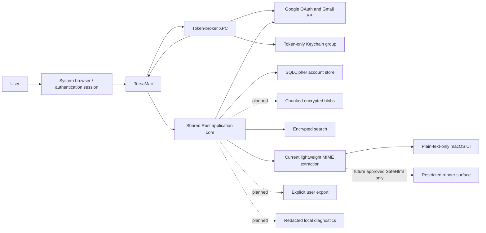

# Security data flow

## Status notation

- **Diagnostic:** implemented only in an isolated M0 spike and not available to
  a user mailbox.
- **Planned:** required by the product architecture but not implemented.
- **Implemented:** a production-shaped local boundary present in the current tree.
- **Closed:** a future boundary that must not receive data in the current tree.

## End-to-end flow

```mermaid
flowchart LR
    USER[User] --> BROWSER[System browser / authentication session]
    BROWSER --> MAIN[TersaMac]
    MAIN --> BROKER[Token-broker XPC]
    BROKER --> GOOGLE[Google OAuth and Gmail API]
    BROKER --> TOKENKEYCHAIN[Token-only Keychain group]
    BROKER --> MAIN
    MAIN --> CORE[Shared Rust application core]
    CORE --> GOOGLE
    CORE --> DB[SQLCipher account store]
    CORE -. planned .-> BLOBS[Chunked encrypted blobs]
    CORE --> SEARCH[Encrypted search]
    CORE --> MIME[Current lightweight MIME extraction]
    MIME --> PLAIN[Plain-text-only macOS UI]
    MIME -. future approved SafeHtml only .-> WEBKIT[Restricted render surface]
    CORE -. planned .-> EXPORT[Explicit user export]
    CORE -. planned .-> DIAG[Redacted local diagnostics]
```

Solid edges describe the current source architecture; dashed edges are planned.
The current MIME extraction is bounded by the raw-message size but is not the
approved hostile-content parser or sanitizer. Raw `body_html` can still cross
the Rust bridge in the JSON buffer, but the Swift model ignores it and the
active UI renders only `body_text` or provider preview. No `SafeHtml`, content
worker, or active WebKit renderer implements the dashed edge.

## Flow inventory

| Flow | Data | Boundary and controls | Current state |
|---|---|---|---|
| OAuth request and callback | Public client ID, PKCE challenge/verifier, state, authorization code, short-lived access token | Main-app loopback listener and system browser; exact redirect and state; token-broker XPC owns PKCE, exchange, refresh, revoke, and token persistence; access token is returned only for a bounded sync call | Broker cutover and real consumer flow are implemented in source; production team provisioning, signed process-isolation evidence, and Google verification remain open |
| Gmail synchronization | Message/thread IDs, labels, headers, bounded raw message bodies, access token during a sync call | Official Gmail REST API; fixed single account; bounded pages/items/body hydration; encrypted snapshot reconciliation | Bounded launch/manual snapshot sync is implemented; History API, polling, multi-account, mutations, drafts, outbox, and attachments remain planned |
| Key hierarchy | Random installation root key and account/version-derived keys | macOS Data Protection Keychain generic-password root record, fixed App Group, private HKDF-SHA256 domain separation, and best-effort zeroization of adapter-owned explicit buffers | Root provisioning, private derivation, retrieval-only CLI composition, and the credentialless owning-product bootstrap source are implemented; PR 33b separately owns signed cross-target interoperability evidence |
| Structured storage | Account-bound message envelopes and cached bodies | Per-account SQLCipher; exact schema and integrity validation; persistent encrypted WAL; in-memory temp policy; envelope-only read capability separate from complete-body/mutation authority | The macOS account store, strict reader, fixed-profile bootstrap composition, and descriptor-relative fresh-failure cleanup are implemented; global store, drafts, pending operations, File Protection evidence, signed runtime, and device evidence remain planned |
| Blob storage | Attachments, inline images, thumbnails, parser results | Future product format remains undecided; the retired M0 candidate used versioned XChaCha20-Poly1305 chunks with authenticated metadata and same-directory publication | No production blob implementation; historical M0 host diagnostic retired in PR3; production manifest, keys, eviction, File Protection, backup, disk-full handling, and device runtime planned |
| Search | Cached subject, addresses, body text, attachment text, query metadata | Bounded product mailbox search over cached metadata; no Tantivy full-text engine in the active product graph | Product bounded search is active; historical Tantivy host diagnostic retired in PR3; physical-device budget for any future full-text engine remains a separate decision |
| MIME and HTML | Untrusted bounded raw message, extracted plain text, and raw HTML | Current lightweight extraction plus immediate plain-text-only UI containment; future bounded parser, typed sanitized output, content worker, and deny-by-default renderer; no automatic remote fetch | Raw HTML is stored/extracted and can be serialized by the bridge, but Swift does not decode or render it; `xtask` denies WebKit/raw-HTML UI surfaces until `SafeHtml` is approved; parser hardening and signed containment evidence remain open |
| Export, share, and clipboard | User-selected attachment or text | Explicit user action and destination preview; data is declassified after leaving the app; never an internal cache | Planned |
| Logs and evidence | Durations, counts, error classes, artifact digests | No content, addresses, query strings, credentials, paths, stable user IDs, or raw fixtures; encrypted local logs where retained | Synthetic aggregate diagnostics only |

## Local persistence inventory

Production code must treat every persistence surface as sensitive. This
includes databases, WAL and journal files, blob manifests and chunks, search
segments, thumbnails, WebKit stores, URL caches, temporary files, app state,
preferences, diagnostics, crash reports, pasteboard content, and exported
files. A new persistence surface is blocked until its encryption, File
Protection, backup, deletion, lock-state, and diagnostic behavior are recorded.

Exports are the only deliberate exception: after explicit confirmation, the
user chooses a destination outside the encrypted application boundary. The UI
must identify that declassification and cannot call the result protected local
storage.

## Future closed boundaries

| Boundary | Prohibited current flow | Required reopening review |
|---|---|---|
| AI provider or local model | No message, header, attachment, prompt, key, or result leaves the current mail boundary | Per-operation data preview and consent, provider retention/training policy, budget, prompt-injection controls, Google restricted-data assessment |
| MCP/CLI mutation | No external client receives mailbox data or authority | Client identity and grants, account/tool scope, pagination, audit, dry-run, idempotency, two-phase send, `maild` ownership |
| OpenPGP | No private key, decrypted plaintext, trust binding, or network discovery | Key hierarchy, algorithm policy, trust UX, interoperability, fuzzing, audit, export compliance |
| Optional relay | No Gmail event, token, device identifier, or notification payload | User-operated deployment, minimum metadata, authentication, Pub/Sub/APNs trust, retention, abuse and incident model |

See the [threat model](threat-model.md) for attacker capabilities, residual
risks, exclusions, and mandatory review triggers.
