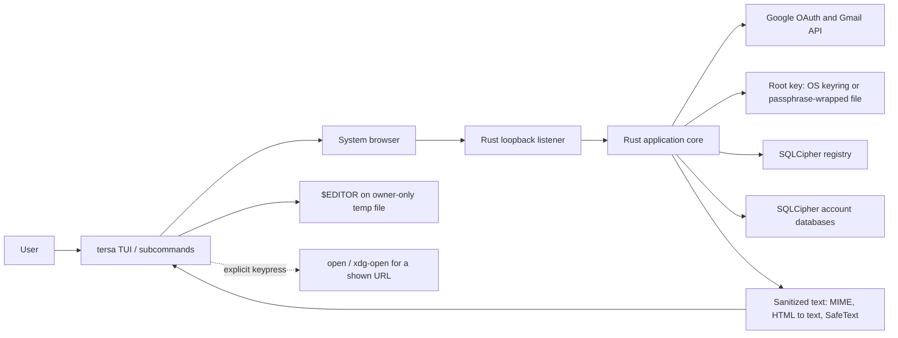

# Security data flow

Status values: **Implemented** (present in the tree), **Planned** (required
by [ADR 0031](../architecture/adr-0031-tui-only-pivot.md), not yet built),
**Closed** (must not receive data).

## End-to-end flow

```mermaid
flowchart LR
    USER[User] --> TUI[tersa TUI / subcommands]
    TUI --> BROWSER[System browser]
    BROWSER --> LOOPBACK[Rust loopback listener]
    LOOPBACK --> CORE[Rust application core]
    CORE --> GOOGLE[Google OAuth and Gmail API]
    CORE --> KEYS[Root key: OS keyring or passphrase-wrapped file]
    CORE --> REG[SQLCipher registry]
    CORE --> DB[SQLCipher account databases]
    CORE --> SAFE[Sanitized text: MIME, HTML to text, SafeText]
    SAFE --> TUI
    TUI --> EDITOR[$EDITOR on owner-only temp file]
    TUI -. explicit keypress .-> OPENER[open / xdg-open for a shown URL]
```

## Flow inventory

| Flow | Data | Controls | Status |
|---|---|---|---|
| OAuth | Client ID/secret from user config, PKCE verifier, state, code, tokens | Loopback redirect, exact state check, PKCE S256, `id_token` audience/issuer/subject validation, identity gate | PKCE, token lifecycle, identity gate implemented in `tersa-application`; Rust loopback planned (T1) |
| Gmail sync | IDs, labels, headers, bounded raw bodies | Official Gmail REST API, bounded pages and bodies, encrypted reconciliation | Bounded snapshot sync implemented; history sync, mutations, drafts, outbox planned (T4–T5) |
| Key hierarchy | Root key, HKDF-derived registry/account/dedup keys | OS keyring or Argon2id-wrapped file; zeroization | HKDF framing implemented in `tersa-keychain-macos`; portable `crates/keys` and `adapters/secrets` planned (T1) |
| Structured storage | Envelopes, bodies, refresh tokens, pending actions, drafts | Per-account SQLCipher, schema validation, owner-only modes | Single-account store implemented; registry and multi-account planned (T3) |
| Display | Headers, bodies, labels, filenames | Sanitizer strips control and bidi characters; HTML to text with limits; no remote fetch | Lightweight MIME text extraction implemented; sanitizer and HTML to text planned (T2) |
| Composition | Draft plaintext | `$EDITOR` on an owner-only temp file removed afterwards; local-first draft in SQLCipher | Planned (T5) |
| Attachments | Attachment bytes | On-demand fetch, size limits, sanitized names, saved only on request, never auto-opened | Planned (T5–T6) |
| Logs | Counts, durations, error classes | No content, addresses, queries, tokens, or stable IDs | Redacted error types implemented |

## Local persistence inventory

Every persistence surface is sensitive: databases, WAL and journal files,
cached bodies and attachments, composition temp files, configuration, and
logs. A new surface is blocked until its encryption, file mode, deletion, and
diagnostic behavior are recorded here.

## Closed boundaries

AI providers, MCP clients, OpenPGP, and any relay receive no data. Reopening
any of them requires an accepted ADR, a data-flow update, and security review.
